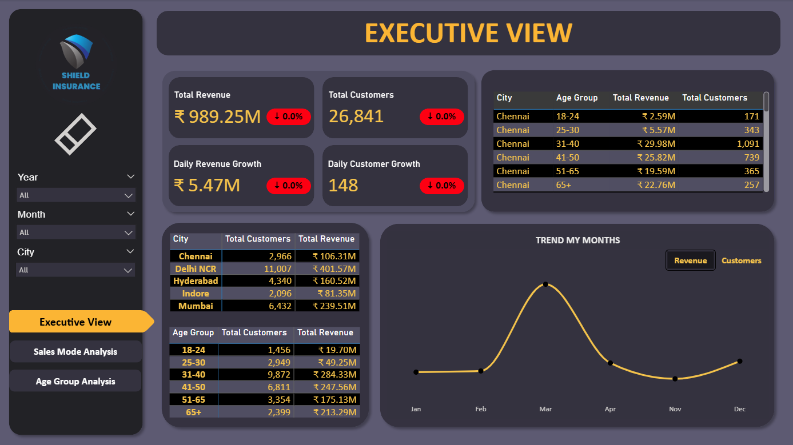
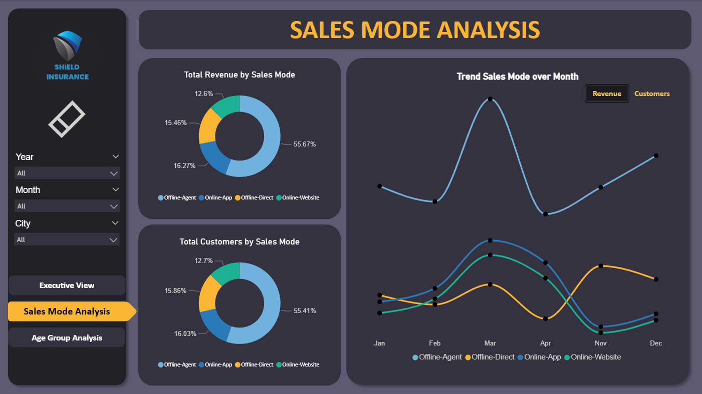
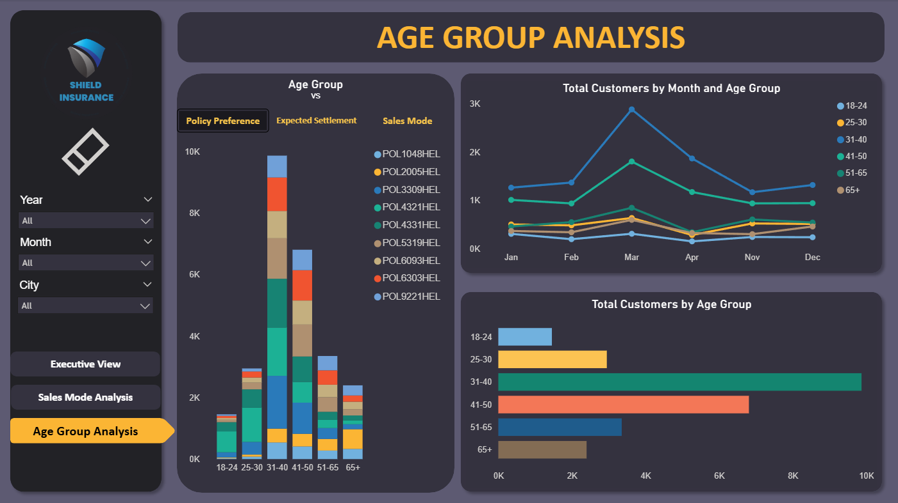
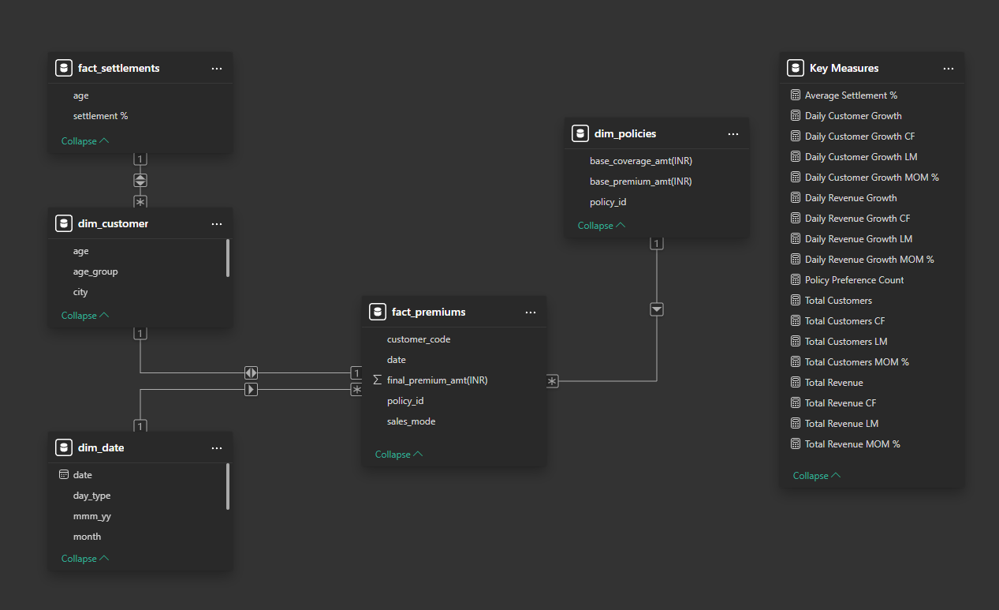

# Shield Insurance – Business Analytics Project

## 📌 Project Overview
This project analyzes **Shield Insurance’s business performance** with a focus on **policy sales, customer demographics, revenue trends, and regional insights**.  
The objective was to deliver a **stakeholder-ready presentation** that connects technical analysis to actionable business recommendations.

---

## 🎯 Purpose
The purpose of this project was to:
- Evaluate overall policy sales and revenue growth.  
- Identify high-value customer segments and regions.  
- Assess product performance across different insurance categories.  
- Provide clear, data-driven recommendations for leadership.  

---

## 🧰 Tech Stack
- Business Analytics  
- Dashboard Design  
- Data Visualization (PowerPoint, Charts, Power BI)  
- Storytelling & KPI Mapping  

---

## 🛠 Approach
- **Data Preparation**: Cleaned and structured insurance datasets (policies, customers, revenue, regions).  
- **Analysis**: Applied business intelligence techniques to measure growth, customer distribution, and product performance.  
- **Visualization**: Designed dashboards and slides with clear charts for executive readability.  
- **Storytelling**: Linked technical outputs to KPIs and strategic actions for decision-making.  

---

## 📸 Dashboard Screenshots

Here are the key dashboards included in this project:

### Executive View

### Sales Mode Analysis

### Age Group Analysis

### Data Model

---

## 🔗 Live Dashboard
Explore the interactive Power BI dashboard here:  
[Shield Insurance Power BI Dashboard](https://app.powerbi.com/view?r=eyJrIjoiOTRkOGRlNDgtYmQyOC00ZWZlLTkxMzEtM2Q0NmRiZjNhMDc0IiwidCI6ImM2ZTU0OWIzLTVmNDUtNDAzMi1hYWU5LWQ0MjQ0ZGM1YjJjNCJ9)

---

## 📊 Stakeholder Analysis

### 1. Executive Overview
- Revenue peaked in **March 2023 (₹263.84M, ↑85%)** but dipped in April (₹153.75M, ↓41.7%).  
- Customer growth mirrored revenue trends, with strong acquisition in March (7,081 customers, ↑82.3%) but slowdown in April (4,149 customers, ↓41.4%).  
- **Delhi NCR and Mumbai** consistently led in both revenue and customer base.  

### 2. City-Level Insights
- **Delhi NCR**: Largest contributor (~40% of revenue). Strong across all age groups.  
- **Mumbai**: Balanced growth, with older age groups (65+) contributing significantly.  
- **Hyderabad & Chennai**: Moderate growth, driven by younger demographics (25–40).  
- **Indore**: Smaller base but high growth potential, particularly in the 65+ segment.  

### 3. Age Group Analysis
- **31–40 years**: Dominant segment, highest revenue and customer counts.  
- **41–50 years**: Strong secondary contributor.  
- **65+ years**: Surprisingly high revenue share, especially in Mumbai and Delhi NCR.  
- **18–24 years**: Lowest contribution but growing steadily in online channels.  

### 4. Sales Mode Analysis
- **Offline-Agent** dominates (~55% of revenue/customers).  
- **Online-App & Online-Website** together contribute ~29%, showing rising digital adoption.  
- **Offline-Direct** steady but less scalable.  
- **Trend**: Online channels growing consistently, especially among younger demographics.  

### 5. Key Findings
- Revenue growth is **seasonal**, with peaks in March and dips in April.  
- **Delhi NCR and Mumbai** are the backbone of Shield Insurance’s revenue.  
- **Digital channels** are gaining traction, particularly among younger customers.  
- **Older demographics (65+)** are unexpectedly strong contributors.  

### 6. Strategic Recommendations
1. **Strengthen Digital Channels** – Invest in app and website experiences to capture younger demographics.  
2. **Target High-Value Segments** – Focus marketing on 31–50 age groups, while designing specialized products for 65+.  
3. **Regional Campaigns** – Expand presence in Tier-2 cities like Indore and Chennai.  
4. **Seasonality Management** – Introduce promotional offers during low-revenue months.  
5. **Agent Enablement** – Continue training and incentivizing offline agents to sustain effectiveness.  

---

## 🚀 Conclusion
Shield Insurance is well-positioned for growth, with strong customer adoption across age groups and cities. The **next phase of strategy should balance digital expansion with regional penetration**, ensuring both younger and older demographics are served effectively.  

---

## 👨‍💻 Author
Developed by **Prashant**  
Passionate about data analytics, visualization, and business intelligence.   
